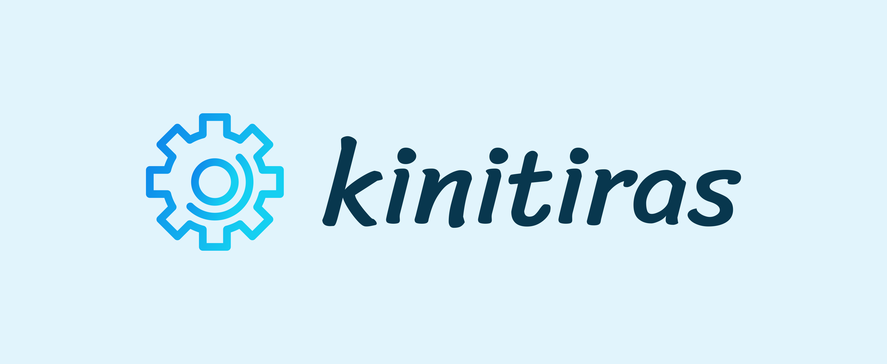

# kinitiras


[](https://github.com/k-cloud-labs/kinitiras/actions?query=workflow%3Abuild)
[](https://codecov.io/gh/k-cloud-labs/kinitiras)
[](https://goreportcard.com/report/github.com/k-cloud-labs/kinitiras)
[](https://pkg.go.dev/github.com/k-cloud-labs/kinitiras)

A **lightweight** but **powerful** and **programmable** rule engine for kubernetes admission webhook.

If you want to use it in clientside with client-go, please use https://github.com/k-cloud-labs/pidolio.

## Quick Start

### Apply crd files to your cluster
```shell
kubectl apply -f https://raw.githubusercontent.com/k-cloud-labs/pkg/main/charts/_crds/bases/policy.kcloudlabs.io_overridepolicies.yaml
kubectl apply -f https://raw.githubusercontent.com/k-cloud-labs/pkg/main/charts/_crds/bases/policy.kcloudlabs.io_clusteroverridepolicies.yaml
```

### Deploy webhook to cluster
All resources will be applied to `kinitiras-system` namespace by default. You can modify the deployment files as your expect.  

Pay attention to the deploy/webhook-configuration.yaml file. The default config will mutate and validate all kubernetes resources filtered by label `kinitiras.kcloudlabs.io/webhook: enabled`.  

**_YOU NEED TO UPDATE THE RULES AS YOUR EXPECT TO MINIMIZE THE EFFECTIVE SCOPE OF THE ADMISSION WEBHOOK._**  

After all changes done, just apply it to your cluster.  

```shell
kubectl apply -f deploy/
```

### Create policy 
Three kind of policy are supported.  

`OverridePolicy` is used to mutate object in the same namespace.  
`ClusterOverridePolicy` is used to mutate object in any namespace.  
`CLusterValidatePolciy` is used to validate object in any namespace.

For cluster scoped resource:
- Apply ClusterOverridePolicy by policies name in ascending;

For namespaced scoped resource, apply order is:
- First apply ClusterOverridePolicy;
- Then apply OverridePolicy;

Both mutate and validate policy are programmable via [CUE](https://cuelang.org/).   

There is a **constraint** that the kubernetes object will be passed to CUE by `object` parameter and the mutating result will be returned by `patches`
parameter and validating result will be returned by `validate` parameter.

Schema:  

```cue
// for input parameter
object: _ @tag(object) 

patch: {
	op: string
	path: string
	value: string
}
// for mutating result
patches: [...patch] 

// for validating result
validate: { 
	reason?: string
	valid: bool
}
```


## Examples
You can try some examples in the example folder.   

The `deletens-cvp.yaml` will protect the namespace labeled with `kinitiras.kcloudlabs.io/webhook=enabled` from being deleted.

The `addanno-op.yaml` will add annotation `added-by=op` to pod labeled with `kinitiras.kcloudlabs.io/webhook=enabled` in the default namespace.

The `addanno-cop.yaml` will add annotation `added-by=cue` to pod labeled with `kinitiras.kcloudlabs.io/webhook=enabled` in the default namespace.  

## Feature
- [x] Support mutate k8s resource by (Cluster)OverridePolicy via plaintext jsonpatch.
- [x] Support mutate k8s resource by (Cluster)OverridePolicy programmable via CUE.
- [x] Support validate k8s resource by ClusterValdiatePolicy programmable via CUE.
- [ ] kubectl plugin to validate CUE.
- [ ] ...

For more detail information for this project, please read the [roadmap](./ROADMAP.md).